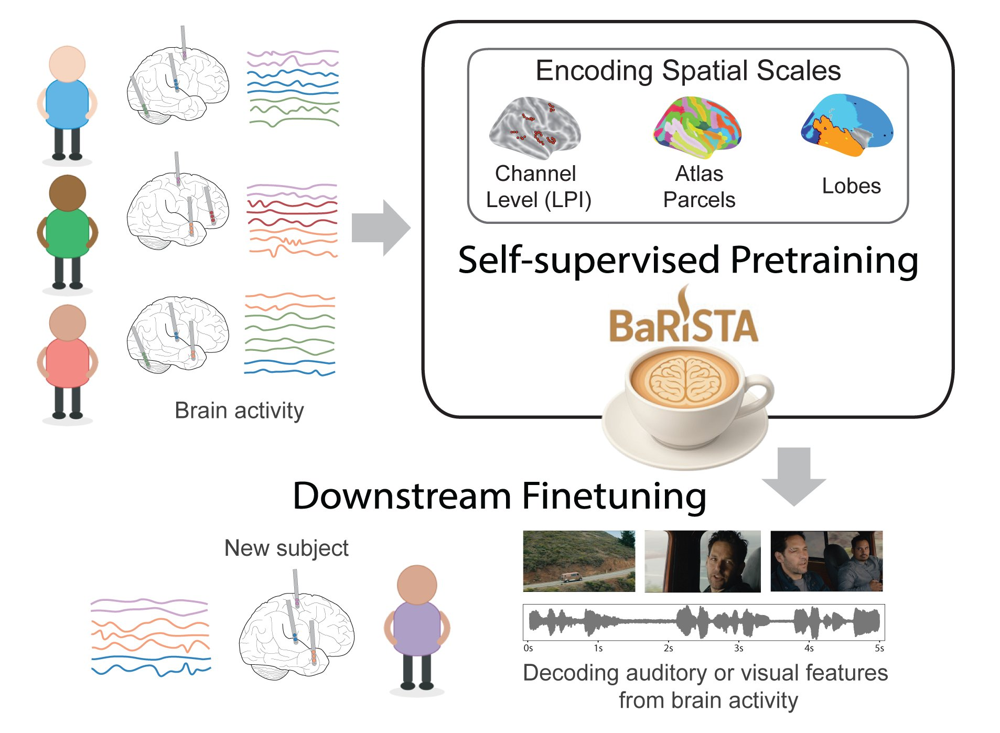

# BaRISTA ☕

[](https://www.python.org/)
[](https://openreview.net/forum?id=LDjBDk3Czb)

This repository contains the official PyTorch implementation of [**BaRISTA** (Brain Scale Informed Spatiotemporal Representation of Human Intracranial Neural Activity)](#publication).


<p align="center">
  
</p>

## Table of Contents
- [Installation](#installation)
- [Data Preparation](#data-preparation)
- [Data Segmentation](#data-segmentation)
- [Finetuning the Model](#finetuning-the-model)
- [Additional Scripts](#additional-scripts)
- [Publication](#publication)

---
## Installation

We recommend setting up a virtual environment to manage dependencies.

```bash
# 1. Create and activate a virtual environment
python -m venv barista_venv
source barista_venv/bin/activate

# 2. Install the package in editable mode
python -m pip install -e .
```

## Data Preparation

1. Download the data from the [Brain Treebank website](https://braintreebank.dev/). You will also need the `clean_laplacian.json` file from the [PopT codebase](https://github.com/czlwang/PopulationTransformer/blob/main/electrode_selections/clean_laplacian.json).

2. Update the `dataset_dir` config in `barista/braintreebank.yaml` to point to the raw data path.

The data directory structure should have the following structure: 

<details> <summary><strong>Click to expand full directory tree</strong></summary>

```
braintreebank_data
            |__corrupted_elec.json
            |__clean_laplacian.json
            |__all_subject_data
            |       |__ sub_1_trial000.h5
            |       |__ sub_1_trial001.h5
            |       |__ sub_1_trial002.h5
            |       |__ sub_2_trial000.h5
            |       |
            |       ...
            |
            |__ electrode_labels
            |       |__ sub_1
            |       |      |__ electrode_labels.json
            |       |__ sub_2
            |       |      |__ electrode_labels.json
            |       ...
            |
            |__ localization
            |       |__ elec_coords_full.csv
            |       |__ sub_1
            |       |      |__ depth-wm.csv
            |       |__ sub_2
            |       |      |__ depth-wm.csv
            |       ...
            |
            |__ subject_metadata
            |       |__ sub_1_trial000_metadata.json
            |       |__ sub_1_trial001_metadata.json
            |       |__ sub_1_trial002_metadata.json
            |       |__ sub_2_trial000_metadata.json
            |       |
            |       ...
            |
            |__ subject_timings
            |       |__ sub_1_trial000_timings.csv
            |       |__ sub_1_trial001_timings.csv
            |       |__ sub_1_trial002_timings.csv
            |       |__ sub_2_trial000_timings.csv
            |       |
            |       ...
            |
            |__ transcripts
            |       |__ ant-man
            |       |      |__ features.csv
            |       |__ aquaman
            |       |      |__ features.csv
            |       ......
```

</details>


## Data Segmentation

You must segment the data **before training**. The required arguments depend on the experiment:

| Experiment Type                                            | `force_nonoverlap` | `experiment` options |
--------------------------------------------------|----------------------|----------------------|
| **1. Random splits**, non-overlapping neural segments (Main Analysis in the paper) | `True`               | `sentence_onset`, `speech_vs_nonspeech` |
| **2. Chronological splits**, increased labels (Appendix K in the paper)         | `False`              | `sentence_onset_time`, `speech_vs_nonspeech_time`, `volume`, `optical_flow` |

### 1. Generating Random Splits with Non-Overlapping Neural Segments

To generate the random splits with non-overlapping neural segments, as used for the main analysis (Section 4), you will need to run the following:

```bash
python barista/prepare_segments.py \
     --config barista/config/braintreebank.yaml \
     --experiment <sentence_onset|speech_vs_nonspeech>
```

> ⚠️ Ensure `force_nonoverlap` in `barista/config/braintreebank.yaml` is set to `True` for this experiment. Incorrect settings will produce invalid splits.


This setting should **only** be used with the `sentence_onset` and `speech_vs_nonspeech` experiments.

### 2. Generating Chronological Splits with Increased Label Data
We can also generate chronological splitting (splitting sessions based on time rather than random shuffling). This approach enables us to increase the number of labeled segments for finetuning by allowing overlap between segments within the same split, while preventing information leakage (i.e., no overlapping neural segments) between train and test splits. To generate the chronological splits used for the evaluation in Appendix K, there are two steps to follow.

First, you will need to segment the data using the following command:

```bash
python barista/prepare_segments.py \
    --config barista/config/braintreebank.yaml \
    --experiment <sentence_onset_time|speech_vs_nonspeech_time|volume|optical_flow>
```

> ⚠️ Ensure `force_nonoverlap` in `barista/config/braintreebank.yaml` is set to `False` for this experiment. Incorrect settings will produce invalid splits.

This setting should **only** be used with the `sentence_onset_time`, `speech_vs_nonspeech_time`, `volume`, and `optical_flow` experiments.


Second, you will need to generate the 5 chronological folds to use during evaluation. To create these different folds, we use the `data/generate_chronological_folds.ipynb` notebook. This notebook automatically will generate 5 different train/valid/test splits across time, while ensuring that all generated splits have both positive and negative labels present. To use the notebook, take the following steps:

1. Open `generate_chronological_folds.ipynb`

2. Update the `_METADATA_FNAMES` variable with the metadata hash string produced from the previous step.

3. Run the notebook to generate the 5 train/valid/test fold pickle files.

The notebook will output a pickle file in the same directory as the specified metadata file and it will be dynamically loaded during train/eval time to ensure the right chronological split fold is used.

## Finetuning the Model
To finetune the model, 

1. Set update `finetune_sessions` field in `barista/config/braintreebank.yaml` to the desired finetuning session.

2. Use the following command to run finetuning:

```bash
python barista/train.py
```

It is important to ensure the `braintreebank.yaml` fields match precisely with the config used during segmentation generation, including the `experiment` field. Otherwise, the metadata hash string will not match and the experiment will fail. For the chronological folds, the experiment will also fail if the pickle file outlined in the second step of [Generating chronological splits with increased label data](#generating-chronological-splits-with-increased-label-data) hasn't been generated.

### Loading Pretrained Model

Pretrained models are available under `pretrained_models/`. Set the `checkpoint_path` in `barista/config/train.yaml` to the specific pretrained model path. e.g. `checkpoint_path: pretrained_models/parcels_chans.ckpt`.

> ⚠️ You also need to set the `tokenizer.spatial_grouping` in `barista/config/model.yaml` accordingly for each of the models.

| Checkpoint Name      | `tokenizer.spatial_grouping` |
| -------------------- | ---------------------------- |
| `chans_chans.ckpt`   | `coords`                     |
| `parcels_chans.ckpt` | `destrieux`                  |
| `lobes_chans.ckpt`   | `lobes`                      |


Alternatively, you can pass these as extra argument to train command:

**Example finetuning command for Parcel level model**
```bash
python barista/train.py \
    --override \
    tokenizer.spatial_grouping="destrieux" \
    checkpoint_path="pretrained_models/parcels_chans.ckpt"
```

## Additional Scripts

You can also use the scripts under `barista/utility_scripts` to run the model for a specific setting across different finetuning seeds. 
The run outputs are saved in the results directory specified in the script and can be easily aggregated using `aggregate_runs.py` across different subjects, models, and folds.

**Example usage for random splits**
```bash
./barista/utility_scripts/run_finetune_random_splits.sh \
    --spe destrieux \
    --checkpoint "pretrained_models/parcels_chans.ckpt" \
    --session HOLDSUBJ_1_HS1_1 \
    --gpu 0 \
    --exp sentence_onset
```


**Example usage for chronological fold**
```bash
./barista/utility_scripts/run_finetune_folds.sh \
    --spe destrieux \
    --checkpoint "pretrained_models/parcels_chans.ckpt" \
    --session HOLDSUBJ_1_HS1_1 \
    --gpu 0 \
    --fold 0 \
    --exp sentence_onset_time
```

### Aggregating Results

You can use `utility_scripts/aggregate_runs.py` to get the average results as a markdown table:

```bash
python barista/utility_scripts/aggregate_runs.py \
    --results_dir <results|results_folds>
```


## Publication
[Oganesian, L. L.\*, Hashemi, S.\*, Shanechi, M. M. BaRISTA: Brain Scale Informed Spatiotemporal Representation of Human Intracranial Neural Activity. In Advances in Neural Information Processing Systems 2025.](https://openreview.net/forum?id=LDjBDk3Czb)


**Citation**
```
@inproceedings{
    oganesian2025barista,
    title={BaRISTA: Brain Scale Informed Spatiotemporal Representation of Human Intracranial Neural Activity},
    author={Oganesian, Lucine L. and Hashemi, Saba and Shanechi, Maryam M.},
    booktitle={Advances in Neural Information Processing Systems},
    year={2025},
    url={https://openreview.net/pdf?id=LDjBDk3Czb}
}
```


## License
Copyright (c) 2025 University of Southern California  <br />
See full notice in [LICENSE.md](LICENSE.md)  <br />
Lucine L. Oganesian, Saba Hashemi, and Maryam M. Shanechi  <br />
Shanechi Lab, University of Southern California
